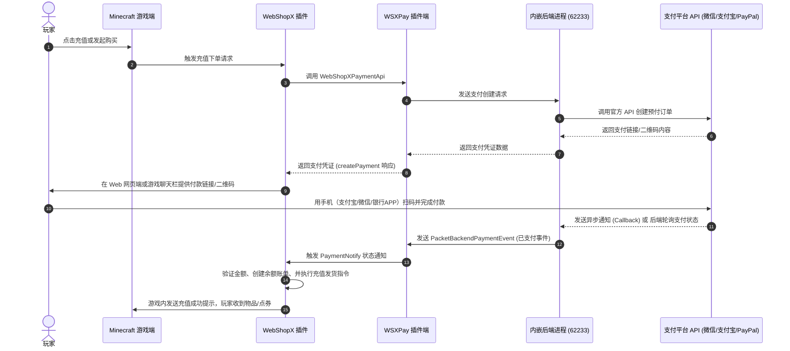

# 安装与部署

本节指导您如何在 Minecraft 服务器中安装 `WebShopX-Payments` 插件，启动内嵌支付服务，并实现与主商城插件 `WebShopX` 的无缝联动。

## 1. 环境要求

- **Java版本**：运行需要 `Java 21` 或更高版本（构建编译推荐使用 `JDK 25`）。
- **Minecraft 服务端**：`Paper 1.20.6+`（兼容 Spigot / Purpur 等常见服务端）。
- **前置依赖**：必须同目录安装 [WebShopX 主插件](https://modrinth.com/plugin/webshopx)。
- **网络连接**：服务器需要具备访问微信、支付宝、PayPal、MercadoPago 等接口的网络能力。如在中国大陆服务器部署且使用 PayPal / MercadoPago 通道，建议在后端配置中启用代理。

## 2. 核心部署流程

### (1) 下载并放置插件
1. 获取 `WebShopX-Payments-<version>-full.jar` 构建包（请确保使用 `with-backend` 发布形态的完整 JAR 包，此包已内含支付后端服务）。
2. 将 JAR 包放入服务器的 `plugins/` 目录。
3. 确保 `WebShopX` 核心插件也已放入 `plugins/` 目录。

### (2) 首次启动生成配置
1. 启动一次服务器。
2. 插件加载后，检测到无配置文件，会自动在服务器根目录下生成以下两个关键配置路径：
   - **`plugins/WebShopX-Payments/config.yml`**：用于控制 Bukkit 插件端支付通道开关与 API 超时。
   - **`plugins/WebShopX-Payments/backend/config.json`**：用于存放支付平台各接口（微信、支付宝、PayPal、MercadoPago等）的敏感商户凭据及证书信息。

### (3) 编辑并修改配置
1. 打开 `plugins/WebShopX-Payments/config.yml`，启用您需要使用的支付渠道（如将 `paypal` 或 `wechat` 的 `enable` 项设为 `true`）。
2. 打开 `plugins/WebShopX-Payments/backend/config.json`，填入对应渠道的商户号、密钥或证书文件路径。
   :::tip[关于密钥路径]
   对于微信 Native 或支付宝官方接口，建议将证书/私钥文件存放在 `plugins/WebShopX-Payments/backend/secrets/` 目录下，并在 `config.json` 中使用 `file:secrets/wechat/apiclient_key.pem` 或 `file:secrets/alipay/private.txt` 的相对路径指向它们。
   :::

### (4) 重启并验证
完成配置后，重启 Minecraft 服务器（或在控制台执行 `/wsxpay reload` 热重载配置）。

---

## 3. 部署成功日志验证

正常启动时，您应该能在控制台（或 `logs/latest.log`）中看到类似以下日志，代表支付 Provider 注册成功，且 WebShopX 主商城已成功绑定该支付服务：

```text
[WebShopX-Payments] Registered WebShopXPaymentApi provider: webshopx-payments
[WebShopX] Payment provider detected; recharge listener registered: webshopx-payments
```

如果启动日志中出现 `PROVIDER_UNAVAILABLE`，请检查 `plugins/WebShopX-Payments/backend/config.json` 是否有 JSON 语法错误，或者内嵌后端的 `port` 端口（默认 `62233`）是否被服务器上的其他进程占用。

---

## 4. 完整的支付事务生命周期

`WebShopX` 与 `WebShopX-Payments` 之间的完整支付与入账时序如下：



:::note[事务失败容灾]
如果在上述第 **14** 步回调发货时，`WebShopX` 的入账监听器因为临时数据库挂起等原因执行失败，该笔已成功付款的交易会在 `wsxpay-orders.yml` 中保留为待确认状态，并在稍后不断发起重试，直到发货逻辑完全成功为止，从而确保不会漏单。
:::
