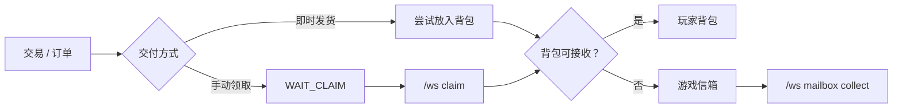

# 背包、领取与信箱

交易完成后，物品可能直接进入背包，也可能等待手动领取或进入游戏信箱。

## 1. 先理解物品流转



如果商品没有立即出现，不代表订单一定失败。先检查订单是否进入 `WAIT_CLAIM`，再检查信箱。

## 2. 领取命令

```text
/ws claim [all|ODR-|MKT-|CLM-|MCL-]
/ws mailbox
/ws mailbox collect
```

推荐顺序：

1. 先执行 `/ws claim all`；
2. 确认背包有空位；
3. 再打开 `/ws mailbox`；
4. 使用 `/ws mailbox collect` 批量收取。

## 3. 网页背包

网页可以展示玩家背包和末影箱，并在服务器允许时直接发起上架、出售或其他交易操作。

| 状态 | 你看到的内容 | 是否可修改/交易 |
| --- | --- | --- |
| 在线实时库存 | 当前服务器中的真实库存 | 可以 |
| 离线只读内容 | 玩家最后一次可用的库存视图 | 不可以 |
| 实验性离线即时管理 | 服务器允许直接操作离线库存 | 取决于服务器配置 |

:::warning[实验性功能]
离线即时库存管理不是所有稳定版本或所有服务器都会开放。网页明确显示为只读时，不要把离线视图当成可写库存。
:::

## 4. 为什么物品会进入信箱

常见原因包括：

- 背包没有足够空间；
- 当前物品无法安全地立即交付；
- 自动发货失败后转为手动领取；
- 服务器选择了延迟/手动交付策略。

## 5. 常见问题

### 页面里的物品和游戏内不一致

先确认页面展示的是“实时库存”还是离线只读内容，然后刷新页面。离线视图不会在玩家未上线时持续同步所有外部变化。

### 网页上的交易按钮不可用

常见原因：玩家离线且只有只读库存、物品受交易规则限制、没有匹配的收购单，或服务器关闭了对应能力。

### `claim` 提示 token 无效

可能是 token 已使用、过期、复制不完整，或订单状态已经变化。优先使用 `/ws claim all`，仍失败时联系管理员并提供订单号。

### `claim_forbidden`

服务器不允许代替其他玩家领取。请由订单所属玩家本人操作。

## 6. 给管理员的信息

涉及离线库存写入、发货补偿、退款和异常订单处理时，请阅读服务器管理员的 [运维与故障处理](../admin/operations)。
