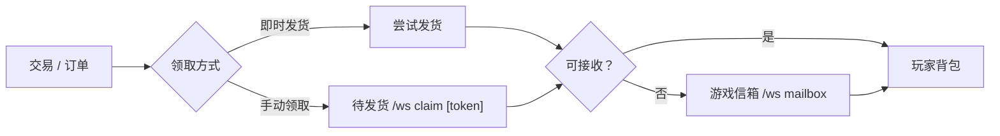

# 领取与信箱

当购买商品却没有立即收到时，你会接触到 `claim` 和 `mailbox`。

:::info[本页导读]
- 链路说明
- 相关命令
- 共享领取开关
- 常见错误
:::

## 1. 链路说明



## 2. 相关命令

```text
/ws claim [all|ODR-|MKT-|CLM-|MCL-]  # 领取待发货物品
/ws mailbox                            # 打开信箱 GUI
/ws mailbox collect                    # 一键领取信箱物品
```

## 3. 共享领取开关

由管理员配置：`allow-shared-claim-command`

- `true`：允许代领
- `false`：仅本人可领，代领报错 `claim_forbidden`

## 4. 常见错误码

| 错误码 | 说明 |
| --- | --- |
| `claim_token_invalid` | token 无效、过期、复制不完整或状态变化 |
| `claim_forbidden` | 尝试代领但服务器未开启共享领取 |

<details>
  <summary>如果你一直领不到，先做这 3 步</summary>

1. 优先尝试 `/ws claim all`。
2. 检查背包是否有空位。
3. 仍失败时联系服主核查该订单/交易状态是否已变更。

</details>
