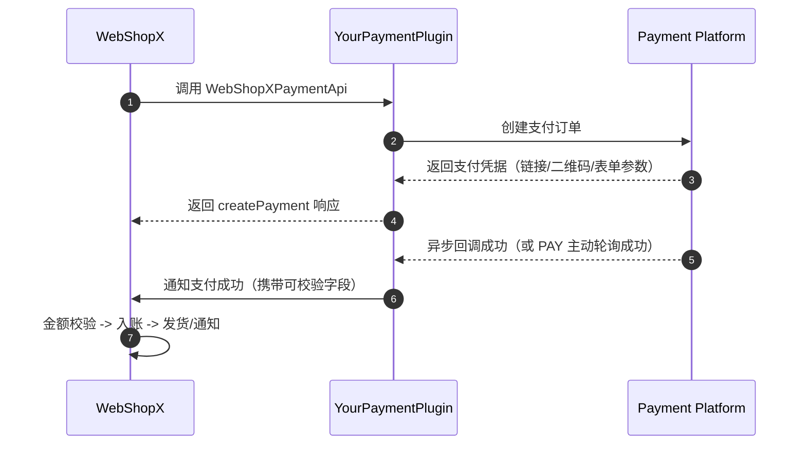

# WebShopXPaymentApi 接入指南

本文面向第三方支付插件作者，聚焦 `WebShopXPaymentApi` 的接入思路与工程实践。示例与术语以当前文档站可见信息为基础，具体字段与方法签名请以你所使用的 `WebShopX` 版本源码/API 为准。

## 适用场景

- 你在开发新的支付渠道插件（非 `WebShopX-Payments` 官方实现）。
- 你希望 `WebShopX` 能识别你的支付 Provider。
- 你需要梳理“建单 -> 支付 -> 到账”的链路与实现边界。

## 总体架构与职责边界

`WebShopX` 与支付插件通常是“业务层 + 支付层”的协作关系：

- `WebShopX` 侧通常负责：充值订单、资产入账、发货与业务状态。
- 支付插件侧通常负责：向渠道建单、接收回调或轮询、回传支付结果。

简化流程如下：



## 接入前置条件

1. 你的插件与 `WebShopX` 在同一 Bukkit/Paper 服务端进程可见。
2. 插件启动后可以完成 API 注册，且 Provider 可被发现。
3. 插件能访问目标支付渠道（网络、证书、系统时间基本正常）。
4. 有明确的订单唯一键与幂等策略。

## Provider 注册

`WebShopX` 检测到 `WebShopXPaymentApi` Provider 后，才会继续走支付通道。

建议在日志中输出明确标识，便于服主与开发者排查：

```text
[YourPlugin] Registered WebShopXPaymentApi provider: <your-provider-id>
[WebShopX] Payment provider detected; recharge listener registered: <your-provider-id>
```

实践建议：

- `providerId` 使用稳定且全局唯一的字符串（例如 `acme-payments`）。
- 插件重载时先注销旧实例，再注册新实例，减少重复绑定风险。
- 依赖未就绪或配置异常时，返回清晰错误并避免“看起来已注册但不可用”的状态。

## createPayment 实现要点

已知 `WebShopX` 会调用 `WebShopXPaymentApi#createPayment` 发起支付。实现上通常可关注以下几点：

1. 输入校验：金额、币种、订单号、玩家标识等关键字段。
2. 渠道建单：调用上游 API 并设置你的幂等键。
3. 响应返回：返回可用于支付展示或跳转的凭据。
4. 追踪关联：保存 `webshopxOrderId` 与 `channelOrderId` 的映射。

常见返回信息包括：

- 展示信息：`payUrl` / `qrContent` / `formPayload`（按渠道能力选择）。
- 关联信息：`providerOrderId`（渠道订单号）。
- 过期信息：`expireAt`（可选，通常有助于前端提示）。

## 支付成功通知与状态管理

建议把“支付成功通知”设计成可重放、可观测、可恢复的流程。可参考以下状态：

- `CREATED`：已创建，等待支付。
- `PENDING`：处理中（可选）。
- `SUCCESS`：支付成功（终态）。
- `FAILED`：支付失败（终态）。
- `CLOSED`：超时或主动关闭（终态）。

通用原则：

1. `SUCCESS` 进入后通常不再回退。
2. 成功通知建议幂等处理，避免重复入账。
3. 终态写库与外部确认建议按一致性策略设计，降低丢单概率。

## 幂等、并发与补偿

支付链路里更常见的问题是重复回调、瞬时失败与重试风暴。

可考虑的基线方案：

1. 幂等键：如 `providerId + channelOrderId` 唯一约束。
2. 并发控制：同一订单同一时刻只允许一次状态推进。
3. 重试机制：通知 `WebShopX` 失败后进入退避重试。
4. 补偿入口：提供按订单触发补发/重试的管理能力。

## 安全建议

1. 对回调进行签名校验与来源校验。
2. 金额核对尽量做到本地记录与平台回执双向一致。
3. 密钥和证书独立存放，避免进入版本仓库。
4. 回调入口是否公网暴露，建议结合反代、鉴权和网络策略评估。

## 兼容性建议

为降低升级成本，可考虑：

- 用适配层实现 `WebShopXPaymentApi`，隔离渠道 SDK 细节。
- 尽量避免业务层 DTO 与渠道层强耦合。
- 升级 `WebShopX` 后执行一次“建单-支付-到账-重试”回归。

## 最小可用接入清单

上线前可重点确认以下项：

1. Provider 可被 `WebShopX` 检测并注册。
2. `createPayment` 能稳定返回支付凭据。
3. 回调签名校验与金额校验可用。
4. 成功通知 `WebShopX` 的链路可达。
5. 重复回调不会导致重复入账。
6. 订单状态可查询（命令或日志）。
7. 失败通知具备重试或补偿机制。
8. 服务重启后未完成订单可恢复。
9. 日志可关联 `webshopxOrderId` 与 `channelOrderId`。
10. 压测下无明显锁争用或吞吐退化。

## 参考实现骨架（伪代码）

> 以下是行为骨架，不是 `WebShopX` 源码中的真实签名；请以当前版本 API 定义为准。
>
> 如果你需要更多信息，欢迎参考 [WebShopX-Payments](https://github.com/Prism-Committee/WebShopX-Payments)仓库。

```java
public final class AcmePaymentProvider implements WebShopXPaymentApi {

    @Override
    public CreatePaymentResult createPayment(CreatePaymentRequest req) {
        validate(req);

        // 1) 幂等建单：本地先落库，状态 CREATED
        PaymentOrder order = orderService.createOrLoad(req.orderId(), req.amount());

        // 2) 调用渠道下单
        ChannelCreateResult channel = channelClient.createOrder(order);

        // 3) 更新映射关系并返回支付凭据
        orderService.bindChannelOrder(order.id(), channel.orderId());
        return CreatePaymentResult.success(channel.payUrl(), channel.qrContent(), channel.expireAt());
    }

    // 回调入口（你的 HTTP Controller / Listener）
    public void onChannelCallback(ChannelCallback payload) {
        verifySignature(payload);

        if (!orderService.tryMarkSuccess(payload.channelOrderId())) {
            return; // 已处理过，直接返回
        }

        // 通知 WebShopX 入账
        webshopxNotifier.notifyPaid(payload.channelOrderId(), payload.amount());
    }
}
```

## 常见排障

- `PROVIDER_UNAVAILABLE`
  - 检查是否真正注册了 `WebShopXPaymentApi`。
  - 检查 `plugin.yml` 依赖顺序与启动日志。

- 能建单但未入账
  - 检查回调签名与金额精度处理。
  - 检查“通知 WebShopX”链路是否被网络或反代拦截。

- 偶发重复入账
  - 检查数据库唯一约束与幂等实现。
  - 检查状态更新和通知调用的事务边界。
