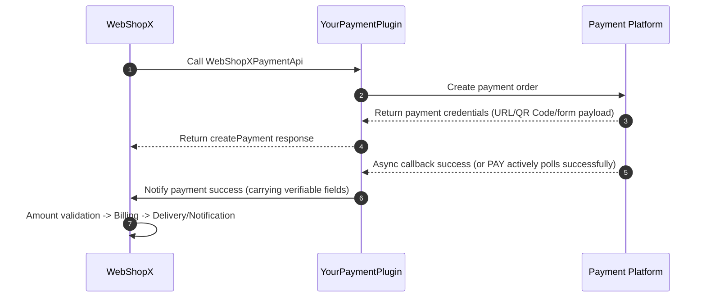

# WebShopXPaymentApi Integration Guide

This document is aimed at third-party payment plugin developers, focusing on integration concepts and engineering practices for `WebShopXPaymentApi`. Examples and terminology are based on the currently available information on this documentation site. Please refer to the source code/API of the specific `WebShopX` version you are using for exact fields and method signatures.

## Applicable Scenarios

- You are developing a new payment channel plugin (non-official implementation of `WebShopX-Payments`).
- You want `WebShopX` to recognize your payment Provider.
- You need to understand the "create order -> pay -> complete" chain and implementation boundaries.

## Overall Architecture & Separation of Concerns

`WebShopX` and a payment plugin usually cooperate in a "business layer + payment layer" fashion:

- The `WebShopX` side is typically responsible for: top-up orders, asset billing, item delivery, and business states.
- The payment plugin side is typically responsible for: creating orders upstream with the payment channel, receiving callbacks or polling, and reporting payment results back.

The simplified sequence flow is shown below:



## Integration Prerequisites

1. Your plugin and `WebShopX` are visible within the same Bukkit/Paper server process.
2. The plugin can complete API registration after startup and its Provider can be discovered.
3. The plugin has connection access to the target payment channel (with normal network connectivity, certificates, and system time).
4. You have defined clear order unique keys and idempotency strategies.

## Provider Registration

`WebShopX` will only invoke the payment pipeline after it detects the `WebShopXPaymentApi` Provider.

We recommend outputting explicit indicators in the log to facilitate troubleshooting for server owners and developers:

```text
[YourPlugin] Registered WebShopXPaymentApi provider: <your-provider-id>
[WebShopX] Payment provider detected; recharge listener registered: <your-provider-id>
```

Practical Recommendations:

- Use a stable and globally unique string for `providerId` (e.g., `acme-payments`).
- Unregister the old instance before registering a new one during plugin reloads to reduce the risk of duplicate bindings.
- If dependencies are not ready or a configuration error occurs, return a clear error and avoid states that "appear registered but are actually unusable".

## createPayment Implementation Highlights

It is known that `WebShopX` will call `WebShopXPaymentApi#createPayment` to initiate a payment. Key focus areas during implementation typically include:

1. Input validation: Crucial fields like amount, currency, order ID, and player identifier.
2. Channel order creation: Call the upstream API and specify your idempotency key.
3. Returning response: Return credentials that can be used to display or redirect to the payment interface.
4. Association tracking: Save the mapping between `webshopxOrderId` and `channelOrderId`.

Commonly returned information includes:

- Display info: `payUrl` / `qrContent` / `formPayload` (choose based on channel capabilities).
- Association info: `providerOrderId` (the payment channel's order ID).
- Expiration info: `expireAt` (optional, usually helpful for front-end prompts).

## Payment Success Notification & State Management

It is recommended to design the "payment success notification" to be replayable, observable, and recoverable. You can refer to the following states:

- `CREATED`: Created, waiting for payment.
- `PENDING`: Processing (optional).
- `SUCCESS`: Payment successful (final state).
- `FAILED`: Payment failed (final state).
- `CLOSED`: Timeout or actively closed (final state).

General Principles:

1. Once `SUCCESS` is reached, it should typically never roll back.
2. Success notifications should be processed idempotently to avoid duplicate billing.
3. Database writes for final states and external acknowledgements should follow strict consistency strategies to minimize the probability of lost orders.

## Idempotency, Concurrency, and Compensation

The most common issues in payment pipelines are duplicate callbacks, transient failures, and retry storms.

Consider the following baseline solutions:

1. Idempotency Key: Such as a unique constraint on `providerId + channelOrderId`.
2. Concurrency Control: Only allow a single state transition at any given time for the same order.
3. Retry Mechanism: Enter backoff retries when reporting a failure to `WebShopX`.
4. Compensation Interface: Provide an administrative capability to trigger order delivery retries or compensation manually.

## Safety & Security Guidelines

1. Perform signature verification and source checking on callbacks.
2. Ensure double-verification of amounts by aligning local records with platform receipts.
3. Store secret keys and certificates independently; avoid checking them into version control repositories.
4. Assess whether callback endpoints are exposed to the public internet using reverse proxies, authorization, and network policies.

## Compatibility Recommendations

To reduce upgrade costs, consider:

- Implementing `WebShopXPaymentApi` with an adapter layer to isolate upstream SDK details.
- Avoiding tight coupling between the business layer DTOs and the channel layer details.
- Performing a full "creation-payment-billing-retry" regression test after upgrading `WebShopX`.

## Minimal Viable Integration Checklist

Before going live, please verify the following items:

1. The Provider is successfully detected and registered by `WebShopX`.
2. `createPayment` stably returns payment credentials.
3. Callback signature validation and amount verification work correctly.
4. The success notification pipeline to `WebShopX` is reachable.
5. Duplicate callbacks do not cause duplicate billing.
6. The order status is queryable (via command or logs).
7. Failed notifications are backed by retry or compensation mechanisms.
8. Unfinished orders can be restored after server restarts.
9. Logs correlate `webshopxOrderId` and `channelOrderId`.
10. No significant lock contention or throughput degradation under load testing.

## Reference Implementation Skeleton (Pseudocode)

> The following is a behavioral skeleton, not the actual signature in the `WebShopX` source code; please refer to the current API definition.
>
> If you need more information, feel free to refer to the [WebShopX-Payments](https://github.com/Prism-Committee/WebShopX-Payments) repository.

```java
public final class AcmePaymentProvider implements WebShopXPaymentApi {

    @Override
    public CreatePaymentResult createPayment(CreatePaymentRequest req) {
        validate(req);

        // 1) Idempotent order creation: Store locally first with state CREATED
        PaymentOrder order = orderService.createOrLoad(req.orderId(), req.amount());

        // 2) Place order with the upstream channel
        ChannelCreateResult channel = channelClient.createOrder(order);

        // 3) Update mapping relations and return payment credentials
        orderService.bindChannelOrder(order.id(), channel.orderId());
        return CreatePaymentResult.success(channel.payUrl(), channel.qrContent(), channel.expireAt());
    }

    // Callback endpoint (your HTTP Controller / Listener)
    public void onChannelCallback(ChannelCallback payload) {
        verifySignature(payload);

        if (!orderService.tryMarkSuccess(payload.channelOrderId())) {
            return; // Already processed, return immediately
        }

        // Notify WebShopX to credit the user
        webshopxNotifier.notifyPaid(payload.channelOrderId(), payload.amount());
    }
}
```

## Common Troubleshooting

- `PROVIDER_UNAVAILABLE`
  - Check if `WebShopXPaymentApi` is truly registered.
  - Check the dependency load order in `plugin.yml` and the startup logs.

- Order created but not credited
  - Check the callback signature and amount precision handling.
  - Check if the "Notify WebShopX" pipeline is blocked by network firewalls or reverse proxies.

- Occasional duplicate billing
  - Check database unique constraints and idempotency implementations.
  - Check transactional boundaries for status updates and notification invocations.
